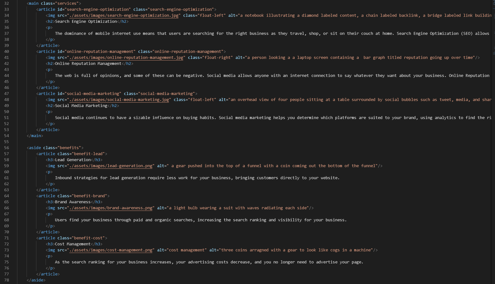

Code Refactoring / Horiseon Website

Welcome to Horiseon Social Solution Services Website!

This website was designed with accessibility in mind. Using various semantic elements, and multiple alt attributes, 
this page is optimized for screen readers. It hase been made using semantic HTML elements, navagation links, 
and CSS styling. All which come together to provide a seamless desktop experience when viewing information about Horiseon. 

Example of semantic structure and alt attribute:

In this example the main tag refers to the biggest section of content on the page, with each article holding a band of information, 
navagation links to bring the user directly to the material, and a concise alt attribute describing the image in great detail. 
    

Getting Started:

The code for this page is avalible at https://scottgeleas.github.io/CodeRefactor/.

Prerequisites:

In order to edit this web page you must have a Github account, and have also downloaded Visual Studio Code.

Create a Github account here: https://github.com/.
Download Visual Studio here: https://code.visualstudio.com/download/.

Built With:

HTML
CSS
Visual Studio Code

Authors:

 Horiseon, Trilogy, Scott Geleas

Acknowledgments:

University of New Hampshire Coding Bootcamp
